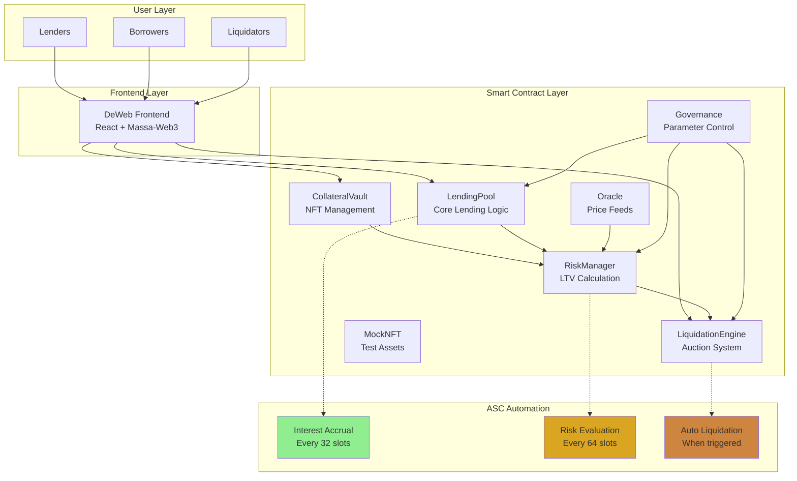

# 🦙 Alpaca Bridge - Autonomous Lending Protocol

A cutting-edge DeFi lending platform built on Massa blockchain, leveraging Autonomous Smart Contracts (ASC) and Real World Assets (RWA) as collateral. Experience the future of decentralized finance with self-executing risk management and guaranteed liquidations.

## 🚀 Live Demo

**[🌐 Try Alpaca Bridge Live](https://alpaca-bridge.dev.massa-deweb.xyz/)**

## 🌟 Core Features

- **🤖 Autonomous Interest Accrual**: Self-executing interest calculations every ~15 minutes via ASC
- **📊 Dynamic Risk Management**: Continuous LTV adjustments based on PD/LGD credit risk models
- **⚡ Automated Liquidations**: ASC-powered liquidation engine with guaranteed execution
- **🏭 RWA Collateral Support**: Enterprise NFTs representing receivables, bills, and invoices
- **🌐 DeWeb Frontend**: Unstoppable interface hosted on Massa's decentralized web
- **🔄 Self-Sovereign Operation**: No external bots, keepers, or manual intervention required

## 🏗️ System Architecture



## 📦 Contract Structure

| Contract | Purpose | Key Functions | ASC Features |
|----------|---------|---------------|--------------|
| **CollateralVault** | NFT collateral management | `depositNFT()`, `withdrawNFT()` | None |
| **LendingPool** | Core lending operations | `deposit()`, `borrow()`, `repay()` | `accrueInterest()` every 15min |
| **RiskManager** | Dynamic LTV calculation | `calculateLTV()`, `evaluate()` | `evaluate()` every 1hr |
| **LiquidationEngine** | Automated liquidations | `liquidate()`, `bid()`, `finalizeAuction()` | `checkAndLiquidate()` on trigger |
| **Oracle** | Price feed management | `updatePrice()`, `getTwap()` | None (external updates) |
| **Governance** | Protocol governance | `setParameters()`, `pause()` | None |

## 💰 Economic Model

### Interest Rate Formula
```
rate = baseRate + (utilization × slope)
where:
- baseRate = 5% APR
- slope = 20% APR
- utilization = totalBorrows / totalDeposits
```

### Dynamic LTV Calculation
```
maxLTV = baseLTV × (1 - riskAdjustment)
where:
- PD ≤ 1%: baseLTV = 80%
- PD ≤ 5%: baseLTV = 75%
- PD ≤ 10%: baseLTV = 70%
- PD ≤ 20%: baseLTV = 65%
- PD > 20%: baseLTV = 60%
- riskAdjustment = (LGD - 50%) × adjustmentFactor
```

### Liquidation Parameters
- **Liquidation Threshold**: 110% of maximum LTV
- **Liquidation Penalty**: 5%
- **Auction Duration**: 1 hour
- **Starting Price**: Debt × (1 + penalty)

## 🚀 Quick Start

### Prerequisites
- Node.js 18+
- Massa wallet with buildnet MAS
- Git

### Installation & Setup

```bash
# Clone the repository
git clone https://github.com/your-repo/alpaca-lb
cd alpaca-lb

# Install dependencies
npm install

# Configure environment
cp .env.example .env
# Add your PRIVATE_KEY to .env file

# Build smart contracts
npm run build

# Deploy contracts
npm run deploy
```

### Start ASC Operations

```bash
# Start autonomous interest accrual
npm run interact startLendingAccrual

# Start autonomous risk evaluation
npm run interact startRiskEvaluation

# Check ASC status
npm run interact checkStatus
```

### Launch Frontend

```bash
cd front-end
npm install
npm run dev
```

### Test the Protocol

```bash
# Mint test NFT
npm run interact mintNFT 1000000 500 4000

# Deposit NFT as collateral
npm run interact depositNFT 1

# Deposit liquidity
npm run interact deposit 100

# Borrow against collateral
npm run interact borrow 1 50000000

# Check protocol stats
npm run interact info
```

## 🔧 Development

### Smart Contract Development

```bash
# Build contracts
npm run build

# Run tests
npm test

# Deploy to buildnet
npm run deploy

# Interact with deployed contracts
npm run interact <command>
```

### Frontend Development

```bash
cd front-end

# Development server
npm run dev

# Build for production
npm run build

# Deploy to DeWeb
npm run deploy
```

## 🎯 User Flows

### For Lenders
1. **Connect Wallet** → Choose MassaStation/Bearby
2. **Deposit MAS** → Earn variable interest based on utilization
3. **Monitor Returns** → Track real-time APY and earnings
4. **Withdraw** → Redeem deposits + accrued interest anytime

### For Borrowers
1. **Mint RWA NFT** → Create tokenized representation of real assets
2. **Deposit Collateral** → Lock NFT in CollateralVault
3. **Calculate LTV** → System determines borrowing capacity based on PD/LGD
4. **Borrow MAS** → Receive funds based on risk-adjusted LTV
5. **Repay Loan** → Return principal + interest to unlock collateral

### For Liquidators
1. **Monitor Auctions** → Track liquidation events in real-time
2. **Place Bids** → Compete for discounted RWA collateral
3. **Win Auctions** → Acquire assets below market value
4. **Profit from Spread** → Benefit from liquidation penalties

## 🛡️ Security Features

- **Reentrancy Protection**: All state changes before external calls
- **TWAP Manipulation Resistance**: Time-weighted average pricing
- **Multi-signature Governance**: Community-controlled parameter updates
- **Emergency Pause**: Circuit breaker for critical situations
- **Automated Risk Monitoring**: Continuous ASC-based surveillance
- **Liquidation Guarantees**: Deferred calls ensure execution

## 📊 Key Metrics

- **Total Value Locked (TVL)**: Total MAS deposited
- **Utilization Rate**: Percentage of deposits currently borrowed
- **Average LTV**: Weighted average loan-to-value ratio
- **Liquidation Rate**: Percentage of positions liquidated
- **ASC Uptime**: Autonomous contract execution reliability

## 🤝 Contributing

We welcome contributions! Please see our [Contributing Guidelines](CONTRIBUTING.md) for details.

### Development Setup
1. Fork the repository
2. Create feature branch (`git checkout -b feature/amazing-feature`)
3. Commit changes (`git commit -m 'Add amazing feature'`)
4. Push to branch (`git push origin feature/amazing-feature`)
5. Open Pull Request

## 📄 License

This project is licensed under the MIT License - see the [LICENSE](LICENSE) file for details.

## 🔗 Links

- **Live Demo**: [https://alpaca-bridge.dev.massa-deweb.xyz/](https://alpaca-bridge.dev.massa-deweb.xyz/)
- **Documentation**: [docs.alpacalb.com](https://docs.alpacalb.com)
- **Discord**: [Join Community](https://discord.gg/alpacalb)
- **Twitter**: [@AlpacaLB](https://twitter.com/AlpacaLB)
- **Medium**: [Technical Blog](https://medium.com/@alpacalb)

## ⚠️ Disclaimer

This protocol is experimental software. Use at your own risk. Always conduct thorough due diligence before depositing funds. The autonomous nature of the system means certain operations cannot be reversed once executed.

---

*Built with 🦙 on Massa blockchain - Where Alpacas Meet Autonomous Finance*